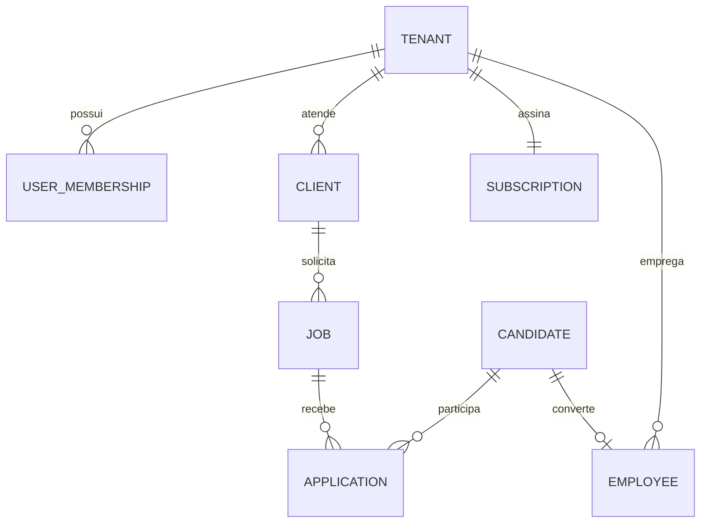
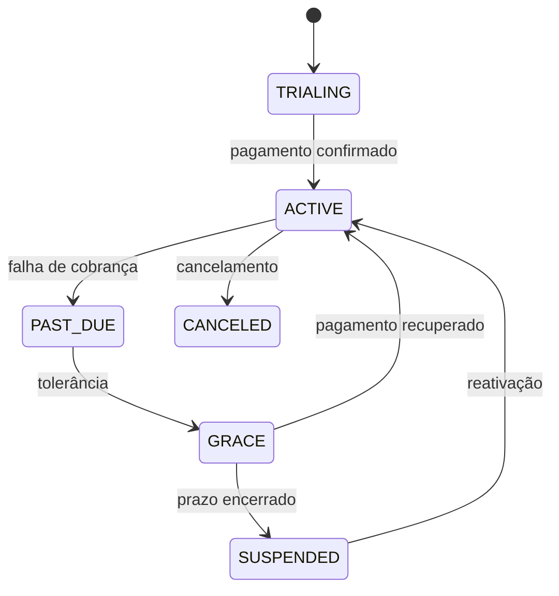

# Arquitetura de produção — Prismae People OS

## Princípios

1. Toda linha de negócio pertence a um `tenant_id`.
2. O tenant vem da sessão autenticada; nunca de um campo livre enviado pelo cliente.
3. Permissão de função e entitlement do plano são verificações diferentes e ambas são obrigatórias.
4. Webhook de pagamento é a fonte para liberar, restringir ou suspender acesso; a página de retorno do checkout não é fonte de verdade.
5. A IA só acessa registros que o usuário poderia consultar manualmente.

## Stack recomendada

- backend: Laravel 12/PHP 8.4 em API modular;
- aplicação web: React/Next ou Blade/Tailwind/Alpine, conforme a equipe que manterá o produto;
- dados transacionais: PostgreSQL 16 ou MySQL 8.4;
- fila/cache: Redis;
- documentos: object storage S3 compatível com URL assinada e antivírus;
- busca: PostgreSQL full text inicialmente; OpenSearch quando o volume justificar;
- observabilidade: logs estruturados, tracing, métricas de filas/webhooks e alertas;
- pagamentos: Mercado Pago no Brasil e/ou Stripe para expansão internacional.

O projeto visual atual pode ser conectado a essa API sem alterar o modelo de produto.

## Domínios e entidades



Domínios: Identity, Tenancy, Billing, CRM, Recruiting, People, Performance, Engagement, Workflow, Analytics, Documents, Notifications e Audit.

## Multi-tenancy

- `tenant_id` obrigatório em tabelas de domínio e índices compostos iniciando por ele;
- escopo global no ORM e policies como segunda camada;
- chaves únicas compostas, por exemplo `(tenant_id, email)` e `(tenant_id, external_id)`;
- jobs de fila carregam `tenant_id` explícito e revalidam a autorização;
- cache sempre prefixado por tenant;
- storage em `tenants/{tenant_id}/...`, com download por URL curta e assinada;
- testes automatizados garantindo que dois tenants nunca enxerguem registros um do outro.

Referência: [OWASP Multi-Tenant Security Cheat Sheet](https://cheatsheetseries.owasp.org/cheatsheets/Multi_Tenant_Security_Cheat_Sheet.html).

## Assinatura e entitlements

Estados internos:



Fluxo seguro:

1. servidor cria checkout/assinatura com `tenant_id` em metadata;
2. provedor envia webhook assinado;
3. endpoint valida assinatura, timestamp e idempotency key;
4. evento bruto é armazenado antes do processamento;
5. worker atualiza `subscriptions`, `invoices` e `entitlements` em transação;
6. cada ação protegida executa RBAC + `assertEntitlement` + limite de uso;
7. UI apenas reflete a decisão do servidor.

Tabela mínima: `plans`, `plan_features`, `subscriptions`, `subscription_events`, `invoices`, `usage_counters` e `entitlement_overrides`. O arquivo `lib/subscriptions.ts` desta entrega formaliza a primeira versão das regras.

Webhooks precisam considerar repetição e chegada fora de ordem. Referências: [Stripe Subscription Webhooks](https://docs.stripe.com/billing/subscriptions/webhooks), [Stripe Entitlements](https://docs.stripe.com/billing/subscriptions/overview), [Mercado Pago Subscriptions](https://www.mercadopago.com.br/developers/en/docs/subscriptions/overview) e [notificações do Mercado Pago](https://www.mercadopago.com.br/developers/en/docs/your-integrations/notifications).

## Autorização

Papéis iniciais: Owner, Admin, Comercial, Recrutador, Gestor, RH, Financeiro, Colaborador e Cliente.

Uma policy deve validar:

```text
sessão válida
  AND membership ativa no tenant
  AND papel permite a ação
  AND registro pertence ao tenant
  AND plano libera o recurso
  AND limite de uso não foi alcançado
```

## LGPD e segurança

- registro de base legal, finalidade e consentimento quando aplicável;
- retenção configurável para candidatos e exclusão/anomização programada;
- fluxo de acesso, correção, portabilidade e eliminação;
- documentos sensíveis com criptografia, URL assinada, classificação e log de visualização;
- MFA obrigatório para administradores; SSO no Custom;
- hash de senha Argon2id, rotação de sessão e revogação por dispositivo;
- CSP, CSRF, rate limiting, validação de upload e segredo fora do repositório;
- trilha imutável para acesso, exportação, alteração salarial, permissão e uso de IA;
- backups testados e política de resposta a incidentes.

Referência legal: [Lei Geral de Proteção de Dados — Lei 13.709/2018](https://www.planalto.gov.br/ccivil_03/_ato2015-2018/2018/lei/l13709.htm).

## IA com governança

- retrieval sempre filtrado por `tenant_id` e policy;
- proibição de usar dados do cliente para treinamento por padrão;
- prompt, fontes, usuário, modelo e resposta registrados com redaction;
- aprovação humana para decisões de seleção, desligamento ou alteração salarial;
- score de candidato explicável e nunca baseado em atributo protegido;
- limites de crédito por plano e proteção contra prompt injection em currículos/documentos.

## Critérios antes de cobrar o primeiro cliente

- domínio e marca validados no INPI;
- termos, privacidade, DPA e política de retenção revisados juridicamente;
- conta de pagamento, chaves e webhooks de produção configurados;
- e-mail transacional e canal de suporte configurados;
- importador de CSV testado com rollback;
- pentest básico, teste de isolamento multi-tenant e restauração de backup;
- monitoramento de cobrança, filas, e-mail e erros;
- onboarding, contrato, SLA e rotina de suporte definidos.

